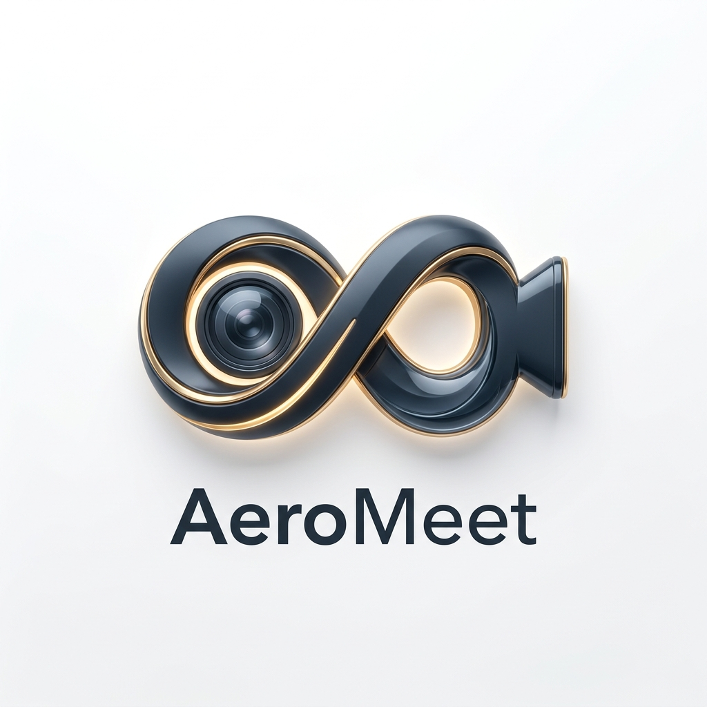

# ✈️ AeroMeet — The Next-Gen AI Video Conferencing Suite

<p align="center">
  
</p>

AeroMeet is an ultra-premium, enterprise-grade video conferencing platform built for the modern era. Transitioning from a standard MERN app, AeroMeet now features a **Gen-Z 3D Aesthetic**, **AeroAI Meeting Intelligence**, and **Real-Time Visual FX**.

## 🚀 Experience the Future
**[Launch AeroMeet Pro](https://github.com/chaitrapatil509-ops/AeroMeet-Ultra-Lightweight-Video-Calls)**

---

## 🔥 Key Highlights

### 🤖 AeroAI: Meeting Intelligence
- **Voice-Activated Assistant:** Just say "AeroAI" to ask about meeting stats, duration, or participants.
- **Executive Summaries:** One-click AI summarization that converts entire call transcripts into bulleted action items.
- **Live Captions:** High-accuracy real-time transcription powered by the Web Speech API.

### 🎭 Pro Visual & Audio FX
- **Virtual Backgrounds:** AI-powered background blur and high-resolution office replacement using MediaPipe.
- **Voice Enhancement:** Pro-grade audio processing (High-Pass Filter & Normalization) to remove background noise and fans.
- **3D Glassmorphism UI:** A sleek, "Slate Pro" and "Studio White" design system featuring bubbly depths and vibrant gradients.

### 👔 Executive Workspace
- **Whiteboard v2:** Collaborative 3D drawing board with pen tools, shapes, and PNG export capabilities.
- **Hardware Pro-Control:** Real-time camera and microphone switching without leaving the call.
- **Meeting Duration & Quality:** Integrated network quality indicators and live meeting timers.

---

## 🛠️ The AeroMeet Stack

- **Frontend:** React.js, Material UI, MediaPipe (AI Vision), Web Audio API.
- **Backend:** Node.js, Express.js (High-Performance Socket.io Architecture).
- **Communication:** WebRTC (Peer-to-Peer Media), Socket.io (Signal Orchestration).
- **Database:** MongoDB & Mongoose (Meeting Persistence & User Auth).
- **Branding:** 100% Custom 3D Logo and Gen-Z Aesthetics.

---

## 💡 Why AeroMeet?

AeroMeet isn't just a clone; it's a re-imagining of how humans should interact digitally. By combining **Intelligence**, **Privacy**, and **Aesthetics**, it solves the problem of "Zoom Fatigue" with an interface that feels alive and an AI that works for you.

---

## ⚙️ Installation & Usage

1. **Clone the Suite**
   ```bash
   git clone https://github.com/chaitrapatil509-ops/AeroMeet-Ultra-Lightweight-Video-Calls.git
   cd AeroMeet-Ultra-Lightweight-Video-Calls
   ```

2. **Environment Setup**
   Create a `.env` in both `Backend` and `Frontend`:
   ```env
   MONGO_URI=your_mongodb_connection_string
   PORT=8000
   ```

3. **Ignition**
   ```bash
   # Backend
   cd Backend && npm install && npm start
   
   # Frontend
   cd Frontend && npm install && npm start
   ```

---

## 👤 Author
Developed and rebranded to **AeroMeet** with a focus on cutting-edge AI and Premium UX.
