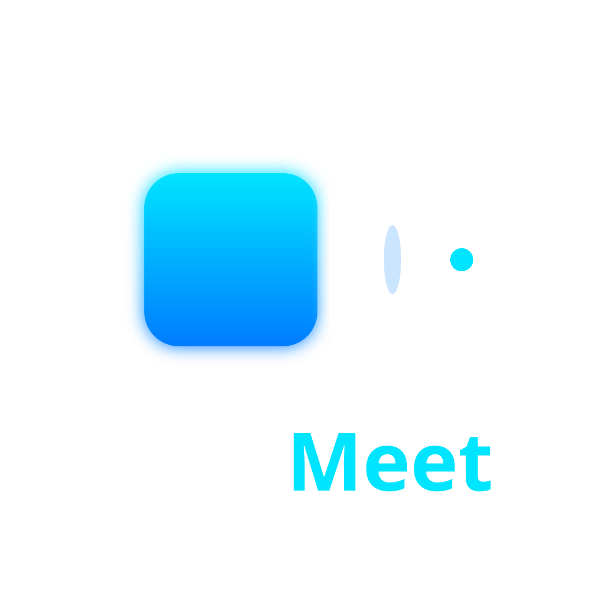

# ✈️ AeroMeet — The Next-Gen AI Video Conferencing Suite

<p align="center">
  
</p>

AeroMeet is an ultra-premium, enterprise-grade video conferencing platform built for the modern era. AeroMeet features a **Gen-Z 3D Aesthetic**, **Multilingual AeroAI Meeting Intelligence**, and **Zero-Config Deployment**.

## 🚀 Experience the Future
**[Launch AeroMeet Pro](https://github.com/chaitrapatil509-ops/AeroMeet-Ultra-Lightweight-Video-Calls)**

---

## 🔥 Key Highlights

### 🤖 AeroAI: Global Intelligence
- **Multilingual Assistant:** Just say "AeroAI" to ask about meeting stats. Supports **English, Hindi, Spanish, and French** with localized speech accents.
- **Executive Summaries:** One-click AI summarization that converts entire call transcripts into bulleted action items and "Executive Briefs".
- **Performance Mode:** Intelligent frame-throttling to ensure smooth AI video effects on low-end hardware.

### 🎭 Pro Visual & Audio FX
- **Virtual Backgrounds:** AI-powered background blur and high-resolution office replacement via the **AeroFX Engine**.
- **Studio Audio Isolation:** Pro-grade audio processing (High-Pass Filter & Dynamics Compression) to isolate your voice from background noise.
- **3D Glassmorphism UI:** A stunning Sapphire-to-Cyan design system featuring liquid gradients and bubbly depths.

### 👔 Executive Workspace
- **Advanced Whiteboard v2.1:** Collaborative drawing with shape tools (Rectangle, Circle), Eraser, and PNG export.
- **Hardware Pro-Control:** Real-time camera and microphone switching without leaving the call.
- **Progressive Web App (PWA):** Installable directly to your device for a native, lightweight experience (<5MB).

---

## 🛠️ The AeroMeet Stack

- **Frontend:** React.js, Material UI, MediaPipe (AI Vision), Web Audio API.
- **Backend:** Node.js, Express.js (High-Performance Socket.io Architecture).
- **Communication:** WebRTC (Peer-to-Peer Media), Socket.io (Signal Orchestration).
- **Database:** MongoDB Atlas (Meeting Persistence & AI Context).

---

## ⚙️ Installation & Deployment

### 1. Local Ignition
```bash
# Backend
cd Backend && npm install && npm start

# Frontend
cd Frontend && npm install && npm start
```

### 2. Zero-Config Deployment
AeroMeet is pre-configured for **Vercel** and **Render**:
- **Frontend:** Connect the `/Frontend` folder to **Vercel**.
- **Backend:** Connect the `/Backend` folder to **Render** and add your `MONGO_URI`.

---

## 👤 Author
Developed and rebranded to **AeroMeet** with a focus on cutting-edge AI and Premium UX.
